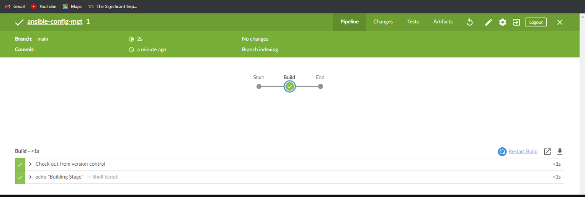
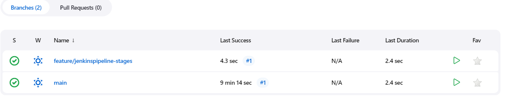
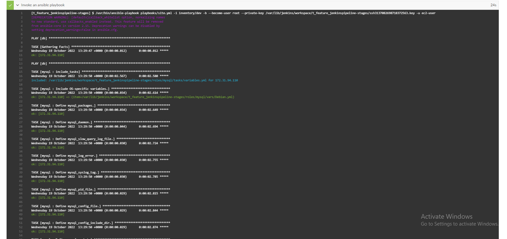
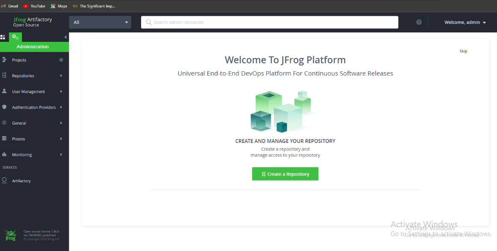
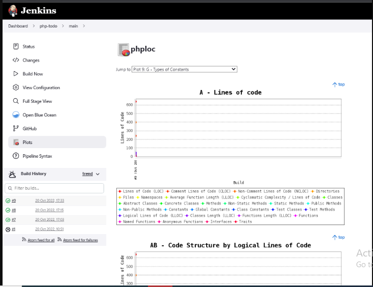
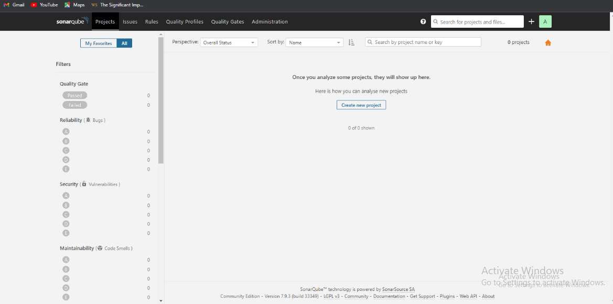

# PECTOR DOCUMENTATION FOR PROJECT 14
The first task was to update my repo with particular modifications to the Inventory folder to now include the following files (ci, dev, uat, sit amonngst others). Inside the ci file, i updated it respectively with jenkins, nginx, sonarqube and artifactory Private IP addresses. i did updated other sub files inisde the inventory folder with the required information.
**Configuring Ansible For Jenkins Deployment**
-
In previous projects, we have been launching Ansible commands manually from a CLI. Now, with Jenkins, we will start running Ansible from Jenkins UI. To do this, navigate to Jenkins URL, install & Open Blue Ocean Jenkins Plugin and Create a new pipeline. What i did was to first install jenkins, java and some relevant dependencies in other to avoid failure while running the ansible playbooks command. I confirmed jenkins was running , 
Afer installing jenkins and installed blue ocean, opened it, connected my github repository to it using the PAT, and configure it accordingly. I opened the terminal, created a new directory and named it `deploy` and created a file inside it with the name `Jenkinsfile`. I updated the jenkinsfile with a task. I configured the ansible project in other to run a pipeline job for the jenkinsfile and this gave me the output accessed though blue ocean.  After this, i created and swithed to a new branch and named it *feature/jenkinspipeline-stages*  so i could add and commit the new changes directly to the new branch and this appeared on jenkins homepage 
. I updated the task in the `jenkinsfile` to now build and test, then pushed and committed it on the new branch. here is the output 
. I merged the updated `jenkinsfile` on the main branch  - I created two new instances for nginx and jenkins respectively. I deleted the dummy taks in the `jenkinsfile` to perform a better task (I updated the jenkinsfile to perform this task) after adding the `ansible.cfg` file inside the `deploy folder`.  I updated my `site.yml`,since i play to run the ansible playbook command against the dev enviroment, so i added the private Ips of jenkins and nginx accordingly, updated the mysql role and I committed and pushed the new changes on the feature/jenkins branch to run ansible from jenkins and the images below was the output:

In other to easily run against the `ci` environment, i updated the `jenkinsfile` to include parameters and i referenced the inventory to include playbook execution stage. I committed and pushed to github. 
- I forked a repo named `phpp-todo` from [darey.io](https://github.com/darey-devops/php-todo.git) and cloned it down to my virtual workspace. I opened a new terminal for `php-todo` and installed php and composer and ensured it was active and running   - I installed plots and artifactory plugin directly on jenkins successfully. I launched a new instance for artifactory and updated the private IP address in the `inventory/ci` file, configured the artifactory role, and updated the tasks and edited the `site.yml`, added a new yml file in the static-assisgnments folder, committed and pushed the changes directly to the main branch. I updated the `jenkinsfile` to chnage the branch and ensured the ansible playbook runs against the `ci` environment. The build was successful and the deployment was done effortlessly. I tried accessing it with the artifactory public ip on port 8082 and it gave thsi output  To confirm if artifactory was successfully deployed, i tried accessing it with the artifactory public ip on port `8082` I configured the artifactory on jenkins page thereafter. 

- Inside the php-todo folder, i addded a new file and named it `jenkisfile` updated it with dummy tasks. In the process, i edited the `ansible-config-mgt/roles/mysql` role, added the mysql private ip address, created a new database and named it (homestead, set the password and also edited the `site.yml` to include `db.yml` inside the `static-assignments`   committed and pushed the changes tomain branch on gtihub. - The new php-todo repository was added on blue ocean and it was successful. On the `php-todo/jenkinsfile` i updated ut and included more codes for phploc and plots  . I accessed it through the browser with its public Ip address on Port 9000 

I created a new branch on the php-todo repository so it could pause SonarQube due to the excessive bugs and threats, code smells which prevented the code from pushing beyond the SonarQube stage. I introduced jenkins slave by creating a new instance, i installed java on the server, configured it on jenkins then i connected my jenkins server to my php-todo repository 

THANK YOU!